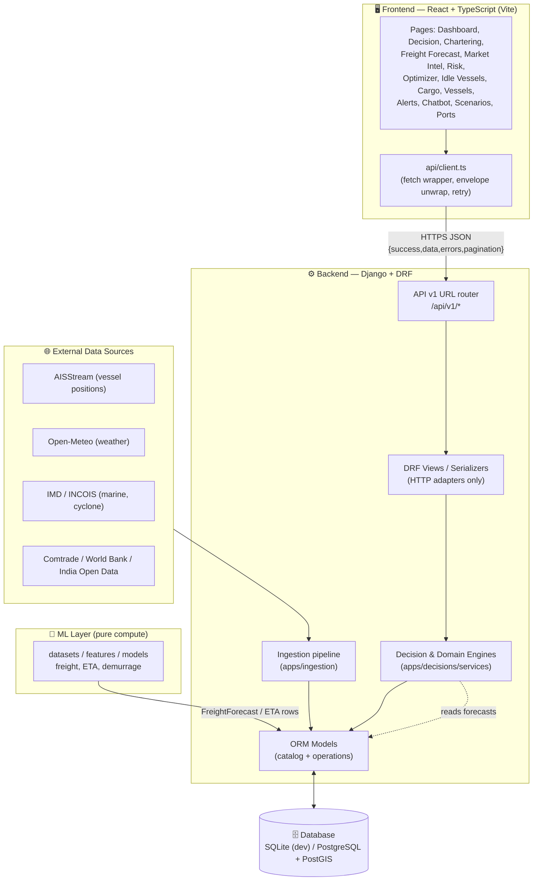
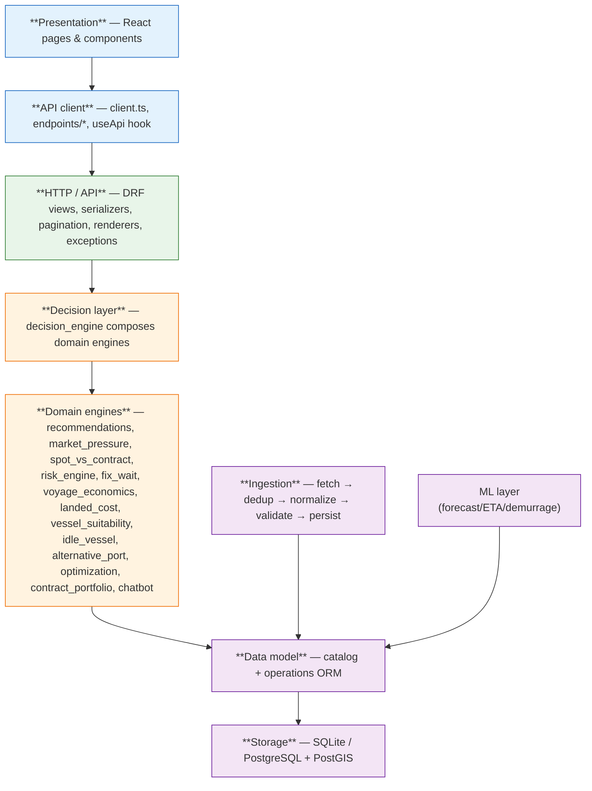
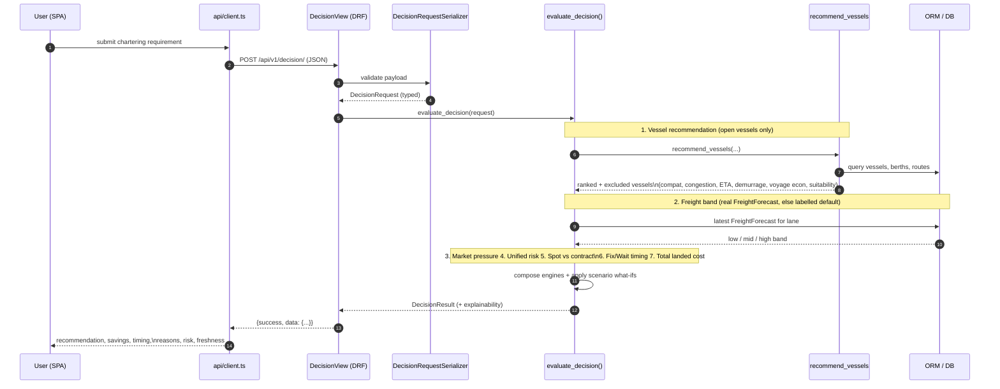
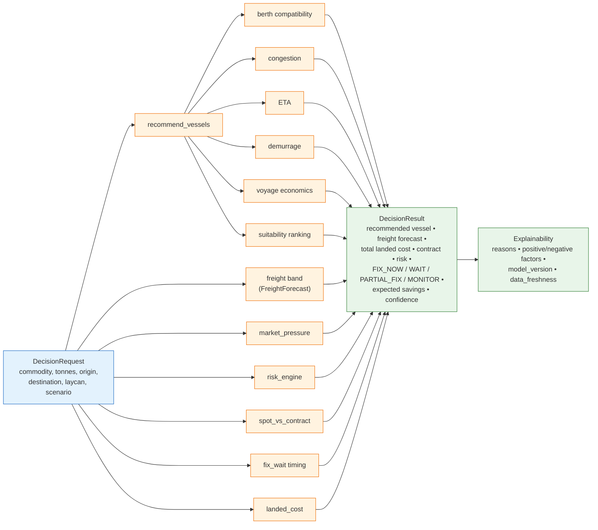
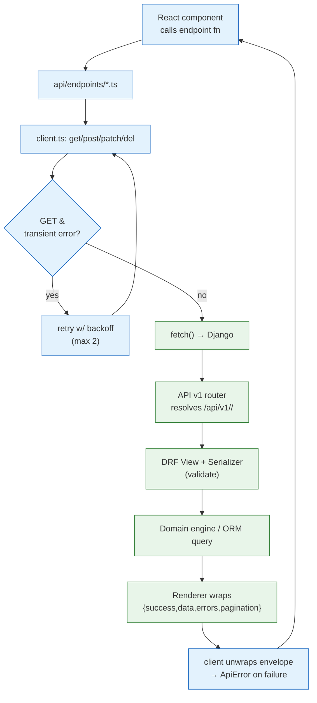
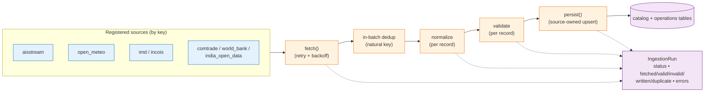
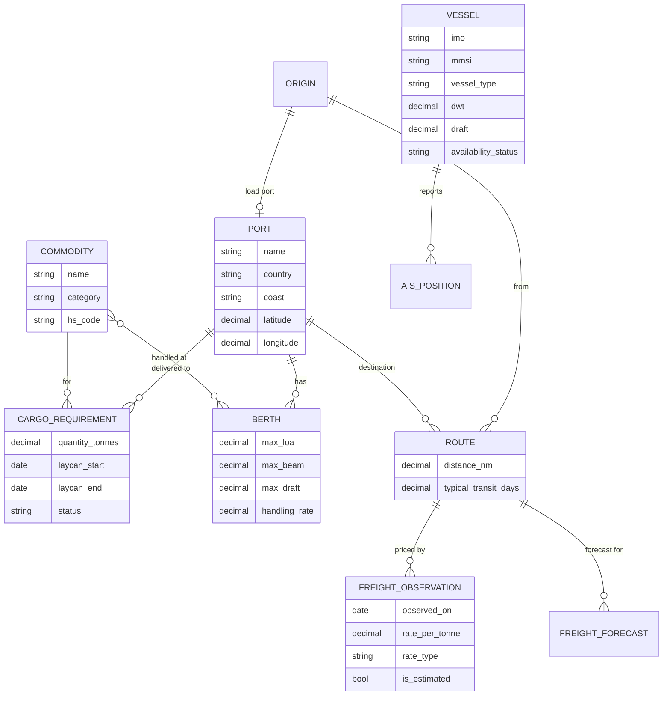
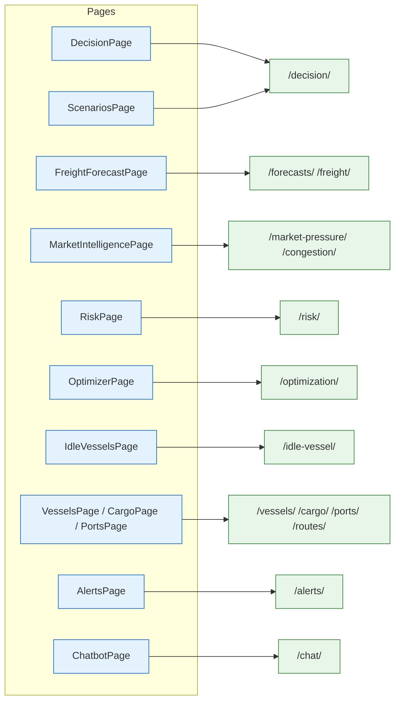
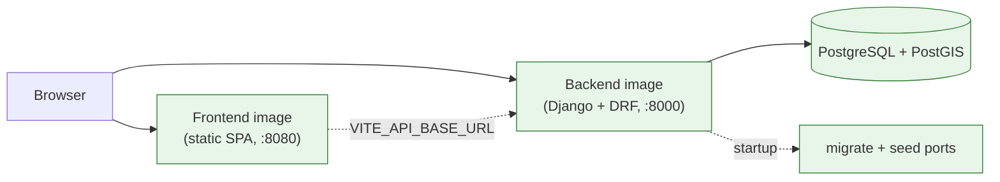

# Vessel — Total Project Flow

Visual, end-to-end map of the **Vessel** platform: an intelligent freight-forecasting and vessel-chartering decision-support system for bulk cargo procurement into India's East Coast ports (SIH 2026).

This document is diagram-first. Every diagram below is a [Mermaid](https://mermaid.js.org/) block that renders on GitHub and in most Markdown viewers. For prose specs see [`../docs/`](../docs/README.md); this file traces *how data and requests flow* through the whole stack.

> **Data labelling.** Values are tagged by nature: **REAL** (observed/stored), **FORECAST** (model output), **ESTIMATED** (derived/heuristic), **SYNTHETIC** (seed/demo). The decision engine never fabricates numbers — every value traces back to a source or a labelled planning default.

---

## 1. System context (bird's-eye)

How the pieces fit: a React SPA talks to a Django/DRF API, which composes domain engines over a modelled database that is populated by an ingestion layer pulling from external providers. A separate ML layer produces forecasts.

---

## 2. Layered architecture

The stack is strictly layered. HTTP views are thin adapters; all business logic lives in engines; engines read from models; models are populated by ingestion and ML.

---

## 3. The core flow — unified decision (`POST /api/v1/decision/`)

This is the heart of the product. A single request composes forecast + vessel + port + cost + contract + risk + timing into one explainable recommendation. The view contains **no business logic** — it adapts HTTP to `evaluate_decision`, which orchestrates the domain engines.

### What the decision engine composes

---

## 4. Request lifecycle (any endpoint)

Every API call follows the same envelope-based path, with safe retry for idempotent GETs only.

---

## 5. Data ingestion pipeline

External providers are pulled through a common, resilient pipeline. Each run is tracked as an `IngestionRun` (status, counters, per-record errors) so data freshness and quality are observable.

Run states: `RUNNING → SUCCESS | PARTIAL | SOURCE_UNAVAILABLE | FAILED`. A missing file or unavailable provider is reported distinctly rather than as a hard adapter failure, and validation failures downgrade a run to `PARTIAL` without losing the good records.

---

## 6. Core data model (ERD)

The `catalog` app holds reference/master data; `operations` holds observed and derived data. Simplified relationships:

`operations` adds observed series (AIS positions, port congestion, weather, marine/cyclone warnings, prices, trade, bunkers) and derived outputs (`FreightForecast`, ETA forecasts, risk scores, recommendations). Geo models carry portable lat/lon plus an optional PostGIS `geom` point.

---

## 7. Frontend page → API map

Each page is backed by domain endpoint modules that all sit on top of the single `client.ts`.

---

## 8. Deployment topology

Frontend and backend build into **separate images** and deploy independently. Local orchestration adds PostGIS.

---

## 9. End-to-end story (one line per hop)

1. External providers → **ingestion** pulls, dedups, validates, and persists REAL data.
2. **ML layer** produces FORECAST rows (freight/ETA/demurrage) into the DB.
3. User opens a page in the **React SPA** and submits a chartering requirement.
4. `client.ts` sends a JSON request through the **DRF router** to the matching view.
5. The view validates input and calls a **domain engine** (or `evaluate_decision` for the unified flow).
6. Engines read modelled data, compose forecast + vessel + cost + contract + risk + timing.
7. The response is wrapped in the standard envelope, unwrapped client-side, and rendered with **explainability** (reasons, factors, model versions, data freshness).

---

## Related docs

- [Docs index](../docs/README.md) · [Architecture](../docs/ARCHITECTURE.md) · [API conventions](../docs/API_CONVENTIONS.md)
- [Data sources](../docs/DATA_SOURCES.md) · [Ingestion architecture](../docs/DATA_INGESTION_ARCHITECTURE.md) · [Explainability](../docs/EXPLAINABILITY.md)
- [Frontend architecture](../docs/FRONTEND_ARCHITECTURE.md) · [Workflows](../docs/WORKFLOWS)
