# Vessel — Total Project Flow

Visual, end-to-end map of the **Vessel** platform: an intelligent freight-forecasting and vessel-chartering decision-support system for bulk cargo procurement into India's East Coast ports (SIH 2026).

This document is diagram-first. Every diagram below is a [Mermaid](https://mermaid.js.org/) block that renders on GitHub and in most Markdown viewers. For prose specs see [`../docs/`](../docs/README.md); this file traces *how data and requests flow* through the whole stack.

> **Data labelling.** Values are tagged by nature: **REAL** (observed/stored), **FORECAST** (model output), **ESTIMATED** (derived/heuristic), **SYNTHETIC** (seed/demo). The decision engine never fabricates numbers — every value traces back to a source or a labelled planning default.

### Contents

1. [System context (bird's-eye)](#1-system-context-birds-eye)
2. [Layered architecture](#2-layered-architecture)
3. [The core flow — unified decision](#3-the-core-flow--unified-decision-post-apiv1decision)
4. [Request lifecycle (any endpoint)](#4-request-lifecycle-any-endpoint)
5. [Data ingestion pipeline](#5-data-ingestion-pipeline)
6. [Core data model (ERD)](#6-core-data-model-erd)
7. [Frontend page → API map](#7-frontend-page--api-map)
8. [Deployment topology](#8-deployment-topology)
9. [End-to-end story](#9-end-to-end-story-one-line-per-hop)
10. [Domain engine catalogue](#10-domain-engine-catalogue)
11. [Fix / Wait timing decision tree](#11-fix--wait-timing-decision-tree)
12. [Unified risk scoring](#12-unified-risk-scoring)
13. [Spot-vs-contract comparison](#13-spot-vs-contract-comparison)
14. [Scenario what-if flow](#14-scenario-what-if-flow-stateless)
15. [Alerts pipeline](#15-alerts-pipeline)
16. [Chatbot flow](#16-chatbot-flow-grounded--graceful-fallback)

---

## 1. System context (bird's-eye)

How the pieces fit: a React SPA talks to a Django/DRF API, which composes domain engines over a modelled database that is populated by an ingestion layer pulling from external providers. A separate ML layer produces forecasts.

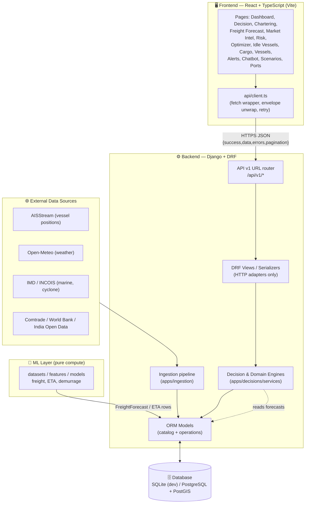

---

## 2. Layered architecture

The stack is strictly layered. HTTP views are thin adapters; all business logic lives in engines; engines read from models; models are populated by ingestion and ML.

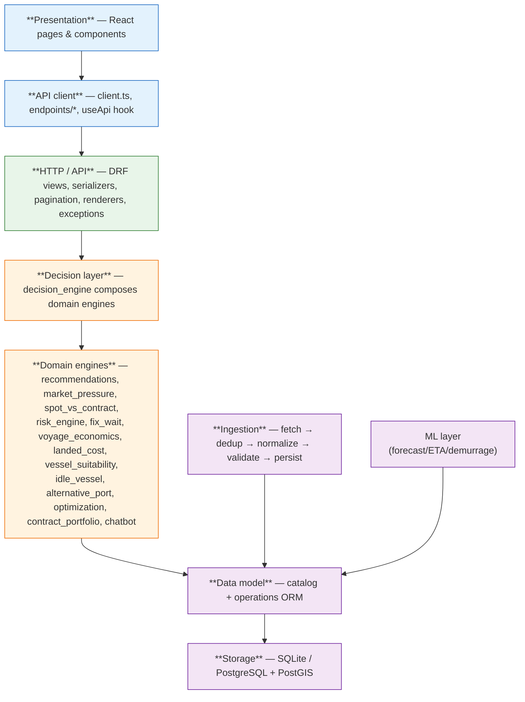

---

## 3. The core flow — unified decision (`POST /api/v1/decision/`)

This is the heart of the product. A single request composes forecast + vessel + port + cost + contract + risk + timing into one explainable recommendation. The view contains **no business logic** — it adapts HTTP to `evaluate_decision`, which orchestrates the domain engines.

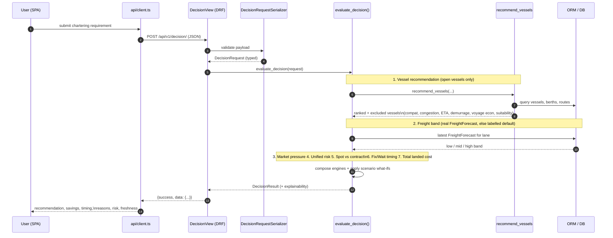

### What the decision engine composes

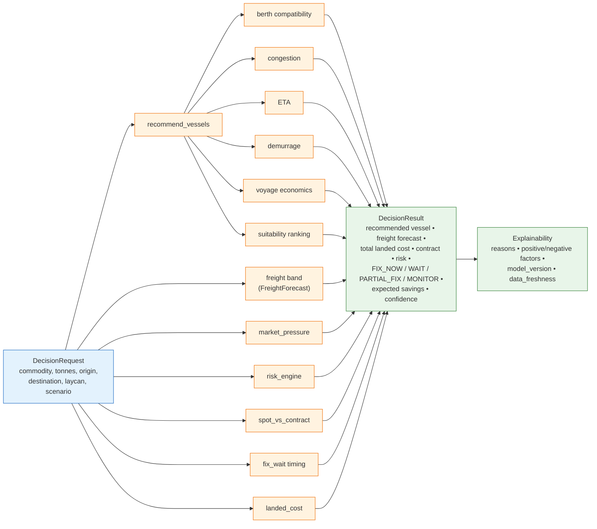

---

## 4. Request lifecycle (any endpoint)

Every API call follows the same envelope-based path, with safe retry for idempotent GETs only.

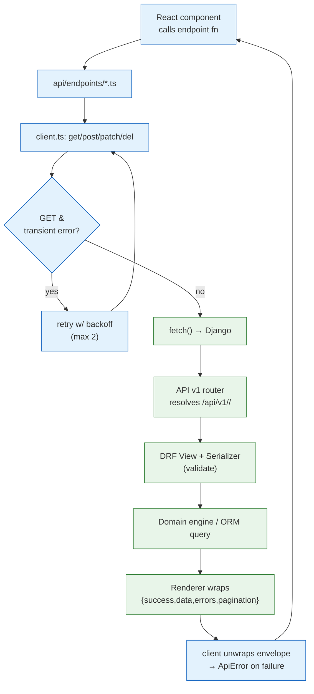

---

## 5. Data ingestion pipeline

External providers are pulled through a common, resilient pipeline. Each run is tracked as an `IngestionRun` (status, counters, per-record errors) so data freshness and quality are observable.

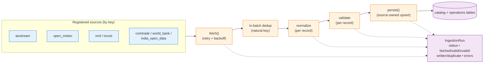

Run states: `RUNNING → SUCCESS | PARTIAL | SOURCE_UNAVAILABLE | FAILED`. A missing file or unavailable provider is reported distinctly rather than as a hard adapter failure, and validation failures downgrade a run to `PARTIAL` without losing the good records.

---

## 6. Core data model (ERD)

The `catalog` app holds reference/master data; `operations` holds observed and derived data. Simplified relationships:

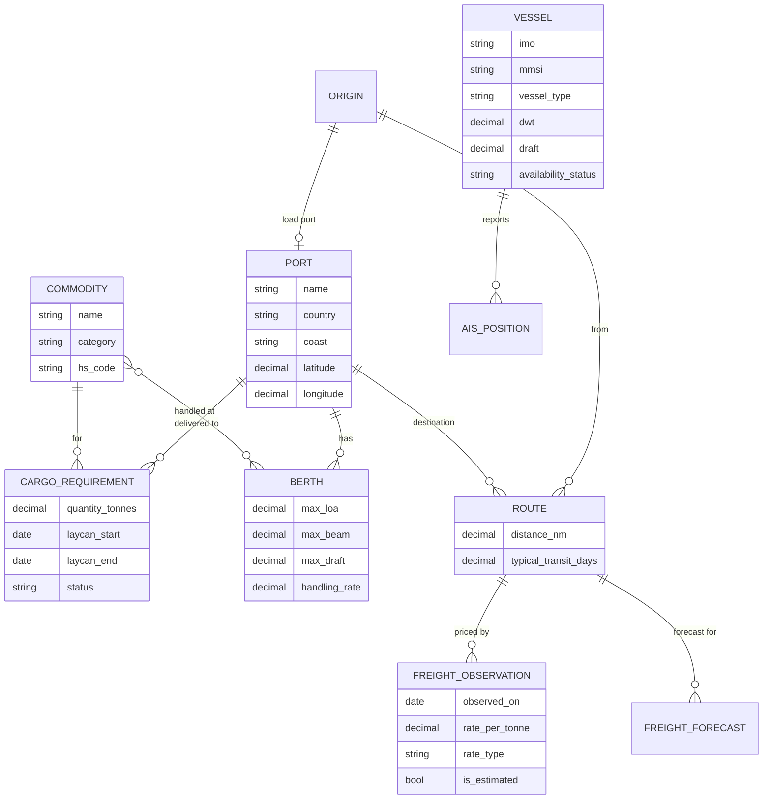

`operations` adds observed series (AIS positions, port congestion, weather, marine/cyclone warnings, prices, trade, bunkers) and derived outputs (`FreightForecast`, ETA forecasts, risk scores, recommendations). Geo models carry portable lat/lon plus an optional PostGIS `geom` point.

---

## 7. Frontend page → API map

Each page is backed by domain endpoint modules that all sit on top of the single `client.ts`.

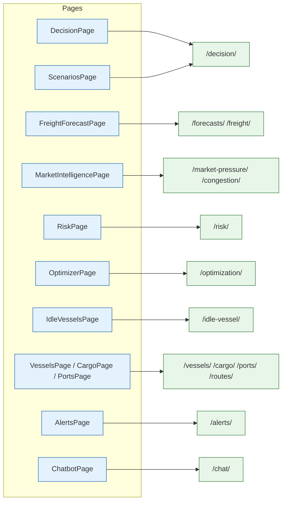

---

## 8. Deployment topology

Frontend and backend build into **separate images** and deploy independently. Local orchestration adds PostGIS.

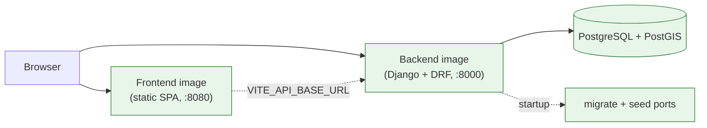

---

## 9. End-to-end story (one line per hop)

1. External providers → **ingestion** pulls, dedups, validates, and persists REAL data.
2. **ML layer** produces FORECAST rows (freight/ETA/demurrage) into the DB.
3. User opens a page in the **React SPA** and submits a chartering requirement.
4. `client.ts` sends a JSON request through the **DRF router** to the matching view.
5. The view validates input and calls a **domain engine** (or `evaluate_decision` for the unified flow).
6. Engines read modelled data, compose forecast + vessel + cost + contract + risk + timing.
7. The response is wrapped in the standard envelope, unwrapped client-side, and rendered with **explainability** (reasons, factors, model versions, data freshness).

---

## 10. Domain engine catalogue

Every engine is **rule-based, deterministic, and explainable** — not ML, not a black-box solver. Each lives in `apps/decisions/services/` (or the paired `catalog`/`operations` service) and returns a structured breakdown alongside its headline number. The ML layer is the only statistical component, and it only produces stored `FreightForecast` / ETA rows that engines read.

| Engine | Module | Input (key signals) | Output |
| --- | --- | --- | --- |
| Vessel recommendation | `recommendations.py` | origin, destination, cargo, commodity, laycan | ranked + excluded vessels |
| Berth compatibility | `catalog.services` | vessel draft/LOA/beam vs berth limits, commodity | COMPATIBLE / CONDITIONAL / INCOMPATIBLE |
| Port congestion | `operations.services.congestion` | AIS positions, port calls | congestion score 0–100 |
| ETA | `operations.services.eta` | route distance, speed, weather risk | ETA + P50/P80/P95 + delay causes |
| Voyage economics | `voyage_economics.py` | distance, speed, tonnes, freight, bunker | freight cost, demurrage, total voyage cost |
| Vessel suitability | `vessel_suitability.py` | dimension fits, freight vs band, ETA, congestion | suitability score 0–100 (the ranking key) |
| Market pressure | `market_pressure.py` | vessel supply, volatility, congestion | index + BALANCED…EXTREMELY_TIGHT |
| Unified risk | `risk_engine.py` | 8 factors (freight/port/weather/eta/demurrage/…) | risk 0–100 + LOW/MED/HIGH + breakdown |
| Spot vs contract | `spot_vs_contract.py` | spot rate, tonnes, volatility, demurrage | recommended strategy + savings |
| Fix / Wait timing | `fix_wait.py` | current rate, 7/14/30d forecast, deadline | FIX_NOW / WAIT / PARTIAL_FIX / MONITOR |
| Landed cost | `landed_cost.py` | freight, duties, port, inland | total delivered cost/tonne |
| Idle-vessel detection | `idle_vessel.py` | AIS dwell, availability | idle candidates |
| Alternative port | `alternative_port.py` | congestion, distance, cost | ranked substitute ports |
| Optimization | `optimization.py` | cargo demands, vessel supply | cargo↔vessel matching |
| Contract portfolio | `contract_portfolio.py` | multiple cargoes, strategies | portfolio-level mix |
| Chatbot | `chatbot.py` | question + inferred lane | grounded NL answer |

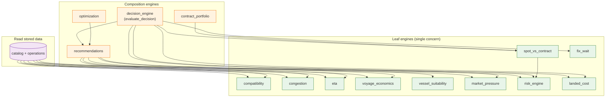

Note the layering: `spot_vs_contract` reuses `risk_engine`; `recommendations` reuses the five leaf engines per candidate; and `decision_engine` sits on top of everything. No engine duplicates another's logic.

---

## 11. Fix / Wait timing decision tree

The timing engine is fully auditable — every branch is a **named, documented threshold** (e.g. `STRONG_MOVE_PCT = 0.05`, `DEADLINE_URGENT_DAYS = 7`). It blends 7/14/30-day forecasts into a confidence-weighted expected move, then walks a deterministic tree.

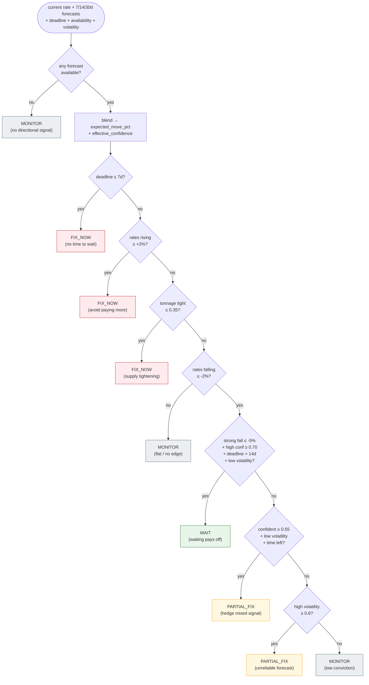

---

## 12. Unified risk scoring

Risk blends up to eight independent factors into one 0–100 score. **Unknown factors are never invented** — a factor with no data stays UNKNOWN, is excluded from the weighting, and its weight is redistributed across the factors that do have data. This is the platform's core honesty rule in action.

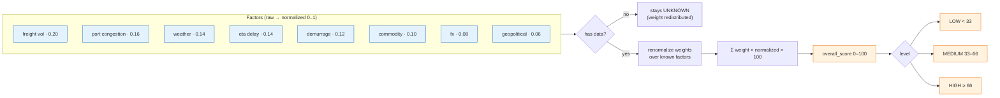

---

## 13. Spot-vs-contract comparison

Four strategies are each costed with documented planning assumptions (freight multiplier, volatility exposure, flexibility, demurrage multiplier), risk-scored via the risk engine, then ranked by **risk-adjusted cost** = `total × (1 + 0.25 × risk/100)`.

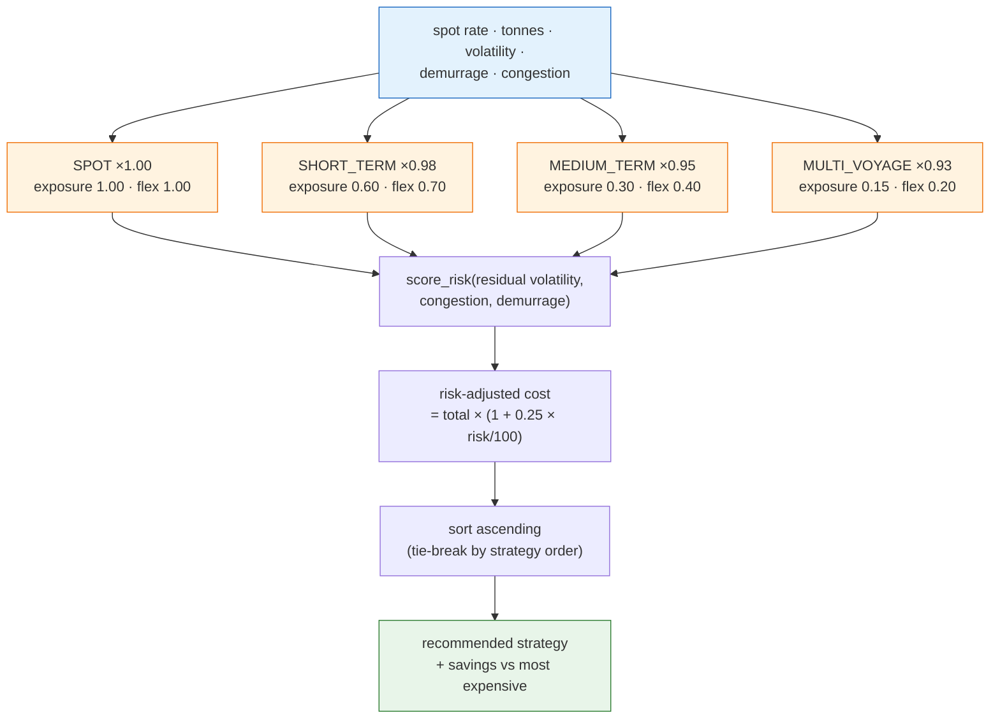

---

## 14. Scenario what-if flow (stateless)

Scenarios are **stateless overrides** — they adjust the downstream timing/contract/risk inputs for a single computation and never mutate stored data. The same real base data drives both the baseline and every what-if.

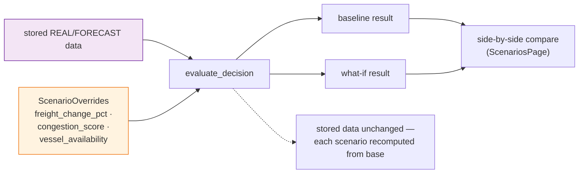

---

## 15. Alerts pipeline

Detectors consume already-computed signals (freight moves, congestion, warnings, market pressure, ETA delay, availability) and raise deduped `Alert` records with documented thresholds, then dispatch notifications.

```mermaid
flowchart LR
    subgraph signals["Computed signals"]
        A1["freight move ≥ 5% / 12%"]
        A2["congestion ≥ 55 / 75"]
        A3["marine warning\nmoderate/high/severe"]
        A4["market pressure\n≥ 75 / ≤ 25"]
        A5["ETA delay prob ≥ 0.6"]
        A6["availability ≤ 0.30"]
    end
    signals --> DET["detectors\n(threshold check)"]
    DET --> DEDUP["dedup on fingerprint"]
    DEDUP --> ALERT[("Alert\ntype · severity · action")]
    ALERT --> DISP["dispatch notifications"]
    ALERT --> API["/api/v1/alerts/ → AlertsPage"]

    classDef s fill:#e3f2fd,stroke:#1565c0;
    classDef p fill:#fff3e0,stroke:#ef6c00;
    class A1,A2,A3,A4,A5,A6 s;
    class DET,DEDUP,DISP p;
```

---

## 16. Chatbot flow (grounded + graceful fallback)

The chatbot is **strictly scoped** to East Coast India bulk-cargo chartering and **grounded** only in the platform's own `evaluate_decision` output. The OpenAI key is backend-only; if it's missing or the call fails, the service returns a deterministic answer composed from the same grounded data — so the endpoint always responds honestly.

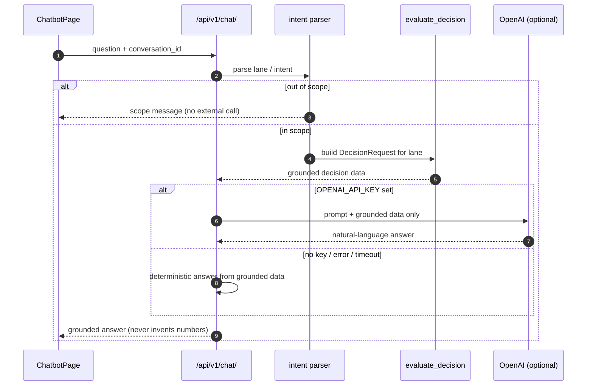

---

## Related docs

- [Docs index](../docs/README.md) · [Architecture](../docs/ARCHITECTURE.md) · [API conventions](../docs/API_CONVENTIONS.md)
- [Data sources](../docs/DATA_SOURCES.md) · [Ingestion architecture](../docs/DATA_INGESTION_ARCHITECTURE.md) · [Explainability](../docs/EXPLAINABILITY.md)
- [Frontend architecture](../docs/FRONTEND_ARCHITECTURE.md) · [Workflows](../docs/WORKFLOWS)
