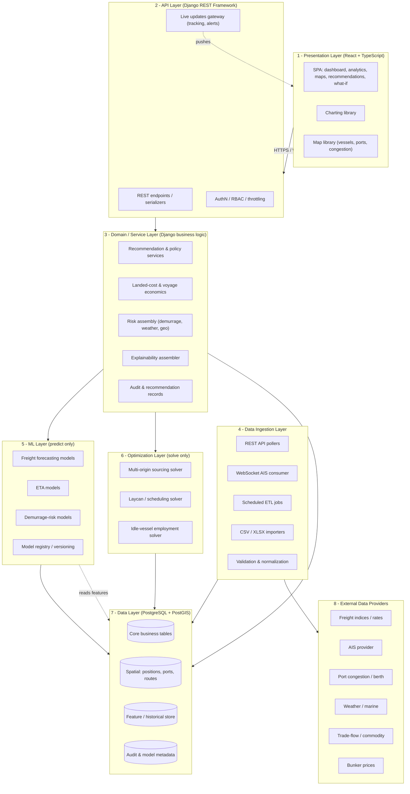
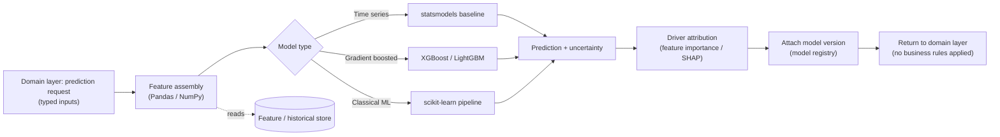
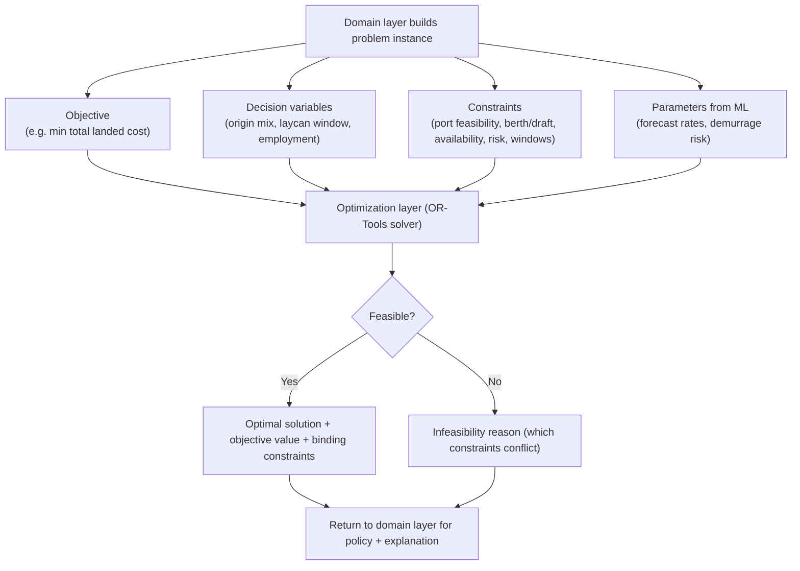
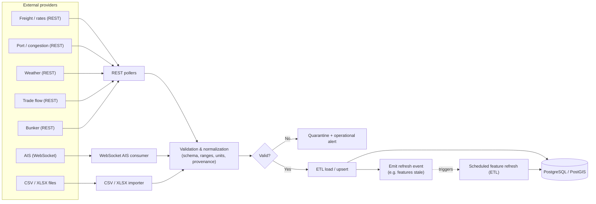
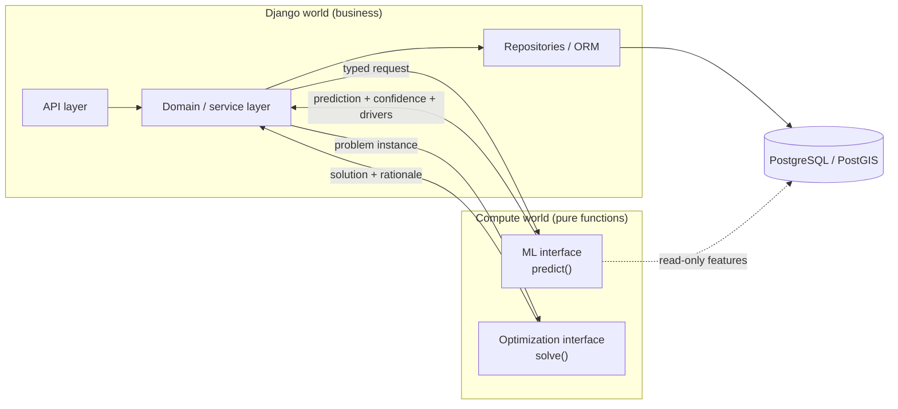

# System Architecture

**Project:** Intelligent Freight Forecasting Model for Optimized Vessel Chartering and Bulk Cargo Procurement from Overseas to the East Coast of India
**Codename:** Vessel
**Document type:** System Architecture Document
**Status:** Draft v1.0

This document describes the target architecture of the platform. It builds on [PROJECT_SPECIFICATION.md](./PROJECT_SPECIFICATION.md), [FUNCTIONAL_REQUIREMENTS.md](./FUNCTIONAL_REQUIREMENTS.md), and [NON_FUNCTIONAL_REQUIREMENTS.md](./NON_FUNCTIONAL_REQUIREMENTS.md). No application code is defined here — this is the blueprint.

---

## 1. Architectural overview

Vessel is a layered, service-oriented application. A React single-page application talks to a Django REST API. Behind the API sits a **domain/service layer** that owns all business logic and orchestrates three specialist subsystems — **data ingestion**, **machine learning**, and **optimization** — over a **PostgreSQL/PostGIS** data layer. External data providers (freight indices, AIS, port, weather, trade, bunker) feed the platform through the ingestion layer.

The guiding principles:

- **Django owns business decisions; ML/optimization own computation.** ML predicts and optimization solves; neither decides policy, applies business rules, or talks to the client. The domain layer translates their numeric outputs into business recommendations. (See §12.)
- **Layers depend downward only.** Presentation → API → domain → (ingestion / ML / optimization) → data. No upward calls, no layer-skipping.
- **Everything explainable and auditable.** Predictions, optimizations, and recommendations carry drivers, confidence, model version, and inputs (NFR-XAI-*, NFR-AUD-*).
- **Graceful degradation.** Missing/stale feeds are labelled, not fatal (NFR-REL-2, NFR-DATA-4).

### 1.1 Technology stack

| Layer | Technology |
| --- | --- |
| Presentation | React, TypeScript, React Router, component-based UI, a charting library (e.g. Recharts/ECharts), a map library (e.g. MapLibre/Leaflet) |
| API | Python, Django, Django REST Framework (DRF) |
| Domain/service | Python (Django application services / domain modules) |
| Data ingestion | REST API clients, WebSocket AIS consumer, scheduled ETL jobs, CSV/XLSX importers |
| ML | Python, Pandas, NumPy, scikit-learn, XGBoost or LightGBM, statsmodels (time series) |
| Optimization | Python, OR-Tools (or an equivalent solver library) |
| Data | PostgreSQL, PostGIS (spatial), for positions/ports/routes |
| Async/scheduling | Task queue + scheduler (e.g. Celery + beat) with a broker (e.g. Redis) |

---

## 2. High-level architecture



---

## 3. Layer 1 — React presentation layer

**Responsibility:** Render the product and capture user intent. No business logic beyond presentation concerns.

- **Stack:** React + TypeScript, React Router for routing, a modern component architecture (feature-based modules, reusable primitives, typed API client, hooks for data fetching, a state-management approach for server/UI state).
- **Charting library:** time-series freight forecasts with confidence bands, historical analytics, KPI visualizations.
- **Map library:** vessel tracking, port locations, congestion overlays, lane visualization — consuming GeoJSON produced from PostGIS.
- **Key views (map to FRs):** Executive Dashboard (FR-ED), Forecast & Historical Analytics (FR-FC, FR-HA), Vessel map & availability (FR-VT, FR-VA, FR-VP), Recommendations (timing/contract/laycan/port/sourcing — FR-MT, FR-CR, FR-LY, FR-AP, FR-MO), Landed-cost comparison (FR-LC), What-if (FR-WI), Alerts (FR-AL).
- **Boundaries:** communicates only with the DRF API over HTTPS; receives live updates (tracking, alerts) over a WebSocket/SSE gateway. Renders explainability payloads produced server-side (it does not compute drivers or confidence).

## 4. Layer 2 — Django REST API layer

**Responsibility:** The single entry point for clients. Transport, contract, authorization, and shaping — not business decisions.

- **Stack:** Django + Django REST Framework.
- **Concerns:** REST resource endpoints, serialization/validation of request/response, authentication, role-based access control (chartering, procurement, analyst, ops, executive, risk, engineer — NFR-SEC-2), throttling/rate limiting, pagination, error normalization, API versioning.
- **Live channel:** a gateway for pushing vessel-tracking updates and alerts to the client (WebSocket/SSE).
- **Boundaries:** the API layer delegates all decisions to the domain layer. It contains **no** ML calls, optimization calls, or business rules directly; it calls domain services and serializes their results. It never queries external providers directly.

## 5. Layer 3 — Domain/service layer

**Responsibility:** The heart of the product. Owns business rules, orchestration, and the translation of ML/optimization outputs into decisions and recommendations.

Representative services:

- **Recommendation & policy services** — market-entry timing (FR-MT), contract-type (FR-CR), alternative-port (FR-AP); apply business thresholds and policy to model/solver outputs.
- **Landed-cost & voyage economics** (FR-LC) — deterministic business math combining cargo cost, freight, bunker-adjusted voyage cost, port/handling, expected demurrage, duties.
- **Risk assembly** — composes demurrage (FR-DR), weather/marine (FR-WR), and geopolitical (FR-GR) risk into decision-ready views.
- **Compatibility & constraints** — vessel-port compatibility (FR-VP) and port/berth constraints (FR-PB) as rule evaluation.
- **Explainability assembler** (FR-XAI) — gathers drivers, confidence, assumptions, and provenance from ML/optimization/domain and packages a human-readable explanation.
- **Audit & recommendation records** (NFR-AUD, BR-16) — persists every recommendation with inputs, model version, and timestamp.

**Boundaries:** this layer *calls* the ML layer for predictions and the optimization layer for solutions, then applies business logic. It is the **only** layer that both consumes ML/optimization results and owns business policy. It reads/writes the data layer through repositories/ORM.

## 6. Layer 4 — Data ingestion layer

**Responsibility:** Bring external data in reliably, validate it, normalize it, and land it in the data layer. It never serves the client and never makes recommendations.

- **REST API pollers** — scheduled pulls from freight, port, weather, trade, and bunker providers.
- **WebSocket AIS consumer** — a long-running consumer subscribing to AIS position streams for vessel tracking (FR-VT) and ETA inputs (FR-ETA); writes positions to PostGIS.
- **Scheduled ETL jobs** — run on the task scheduler; transform and load provider data, refresh derived/feature tables, and compute analytics inputs.
- **CSV/XLSX importers** — manual or partner-provided files (e.g. port constraints, manual rates), clearly tagged as non-authoritative where relevant (NFR-DATA-4).
- **Validation & normalization** — schema/range/plausibility checks, unit and currency normalization, provenance/freshness tagging, anomaly quarantine (NFR-DATA-1..3).

**Boundaries:** ingestion is the *only* layer that talks to external providers. It writes to the data layer and emits events/signals (e.g. "new positions", "rates refreshed") that can trigger downstream ML feature refresh — but it does not call ML or optimization directly.

## 7. Layer 5 — ML layer

**Responsibility:** Prediction only. Given features, produce numeric predictions with uncertainty and driver attributions. No business rules, no client access, no persistence of business decisions.

- **Stack:** Pandas/NumPy for feature engineering, scikit-learn pipelines, XGBoost or LightGBM for gradient-boosted models (freight, demurrage risk, ETA components), statsmodels for classical time-series where appropriate (seasonality, ARIMA-family baselines).
- **Models:** freight forecasting (FR-FC) with confidence bands; ETA models (FR-ETA); demurrage-risk models (FR-DR).
- **Model registry / versioning** — every model is versioned; predictions carry the model version (NFR-ACC-3). Training is an offline/batch concern; serving exposes a prediction interface consumed by the domain layer.
- **Explainability** — models expose feature importances / attributions (e.g. SHAP-style) that the domain layer's explainability assembler surfaces.

**Boundaries:** the ML layer exposes a narrow, well-typed prediction interface (Python service functions/module) to the domain layer. It **reads features** from the data/feature store and **returns predictions**; it does not write business tables, does not enforce business policy, and is never called by the API or client directly. See §12 for the Django↔ML boundary contract.

## 8. Layer 6 — Optimization layer

**Responsibility:** Constrained optimization only. Given a well-defined problem (objective, decision variables, constraints), return an optimal/feasible solution. No business policy authorship, no client access.

- **Stack:** OR-Tools (or equivalent) solvers.
- **Solvers:** multi-origin sourcing optimization (FR-MO) minimizing total landed cost subject to port feasibility, availability, and risk; laycan/scheduling optimization (FR-LY) minimizing expected demurrage/waiting subject to congestion/weather/berth windows; idle-vessel employment (FR-IV) maximizing expected voyage economics.
- **Inputs:** the domain layer builds the problem instance from business data + ML predictions (e.g. forecast rates, demurrage-risk estimates) and passes it in.

**Boundaries:** the optimization layer receives a fully-specified problem from the domain layer and returns a solution + rationale (which constraints bind, objective value). It does not fetch data, call ML, or decide which problem to solve — the domain layer does that. See §12.

## 9. Layer 7 — PostgreSQL/PostGIS data layer

**Responsibility:** Durable, consistent storage and spatial queries.

- **Core business tables** — vessels, ports, berths & constraints (FR-PB), lanes, voyages, cargoes, rates, recommendations, alerts.
- **Spatial (PostGIS)** — vessel positions and tracks, port geometries, lane/route geometries, congestion zones; enables distance, proximity, and geofence queries feeding ETA and map views.
- **Feature / historical store** — historical rates, engineered features, and forecast-vs-realized records for analytics (FR-HA) and model evaluation (NFR-ACC-4).
- **Audit & model metadata** — recommendation audit trail, model versions, alert log (NFR-AUD, NFR-ACC-3).

**Boundaries:** accessed by the domain, ingestion, ML (reads/feature writes), and optimization layers via the ORM/repositories. All data carries provenance and freshness metadata (NFR-DATA-3).

## 10. Layer 8 — External data providers

**Responsibility:** Source systems, integrated only through ingestion (Layer 4).

- Freight indices/rates, AIS provider, port congestion/berth data, weather/marine forecasts, trade-flow/commodity data, bunker prices.
- Integrated behind well-defined interfaces so a provider can be swapped without touching core logic (NFR-INT-1). Treated as untrusted input and validated (NFR-SEC-5). Where a feed is unavailable, the platform degrades gracefully (NFR-REL-2).

---

## 11. Diagrams — key flows

### 11.1 Request flow (interactive recommendation)

```mermaid
sequenceDiagram
    participant U as User (React SPA)
    participant API as DRF API Layer
    participant D as Domain / Service Layer
    participant ML as ML Layer
    participant OPT as Optimization Layer
    participant DB as PostgreSQL / PostGIS

    U->>API: GET recommendation (lane, port, requirement)
    API->>API: AuthN + RBAC + validate
    API->>D: request recommendation
    D->>DB: load business data (vessel, port, constraints, costs)
    D->>ML: request predictions (forecast, demurrage risk)
    ML->>DB: read features
    ML-->>D: predictions + confidence + drivers + model version
    D->>OPT: solve (problem built from data + predictions)
    OPT-->>D: solution + binding constraints + objective
    D->>D: apply business policy, compute landed cost, assemble explanation
    D->>DB: persist recommendation (audit: inputs, model version, ts)
    D-->>API: recommendation + explanation
    API-->>U: serialized response
```

### 11.2 ML prediction flow



### 11.3 Optimization flow



### 11.4 Data ingestion flow



---

## 12. Boundary between Django business logic and ML/optimization code

This separation is a hard architectural rule, not a convention.

| Concern | Django domain layer (business logic) | ML layer | Optimization layer |
| --- | --- | --- | --- |
| Owns business rules & policy | **Yes** | No | No |
| Decides *what* to compute/solve | **Yes** | No | No |
| Produces numeric predictions | No | **Yes** | No |
| Solves constrained problems | No | No | **Yes** |
| Applies thresholds, converts numbers → recommendations | **Yes** | No | No |
| Talks to the API/client | **Yes** (via API layer) | Never | Never |
| Reads business/feature data | Yes (repositories) | Reads features only | Receives inputs from domain |
| Writes business tables / audit | **Yes** | No | No |
| Attaches confidence & drivers | Consumes & assembles | **Produces** | Produces (binding constraints) |
| Model/solver versioning | Records with recommendation | **Owns model registry** | Owns solver config |

**Contract rules:**

1. The domain layer calls ML/optimization through **narrow, typed interfaces** (Python service functions/modules) — request objects in, result objects out. No leaking of ORM models or Django request objects into ML/optimization code.
2. ML and optimization are **pure computation**: same inputs → same outputs (given a fixed model/solver version), no side effects on business state, no client awareness.
3. The domain layer is responsible for **feature/problem construction**, **business policy**, **landed-cost math**, **explanation assembly**, and **persistence/audit**.
4. ML/optimization code lives in **separate modules/packages** from Django apps so it can be tested, versioned, and evolved independently, and could later be extracted into its own service without rewriting business logic.
5. Predictions and solutions always return **uncertainty/binding-constraint information** so the domain layer can honour explainability (NFR-XAI) and accuracy-tracking (NFR-ACC) requirements.



---

## 13. Cross-cutting concerns

- **Async & scheduling:** long-running ingestion (AIS consumer), scheduled ETL, model training/batch scoring, and heavy optimization run off the request path via a task queue + scheduler (Celery/beat + broker), keeping the API responsive (NFR-PERF-1..4).
- **Security:** TLS in transit, encryption at rest, RBAC, secret management, least privilege (NFR-SEC-1..6). External data treated as untrusted.
- **Observability:** logs, metrics, health for data freshness, job status, model performance, errors (NFR-MNT-2); operational alerts on ingestion/model failures.
- **Explainability & audit:** every recommendation persisted with inputs, drivers, confidence, model version, timestamp (NFR-XAI, NFR-AUD, NFR-ACC-3).
- **Configuration:** lanes, ports, berth constraints, cost parameters, and duties externalized from code (NFR-MNT-3).
- **Deployment:** containerized, reproducible, environment-separated (NFR-DEP-1..3).
- **Degradation:** stale/estimated/missing data clearly labelled end-to-end (NFR-REL-2, NFR-DATA-4).

## 14. Traceability to requirements

- Layers 1–8 realize the five capability layers in [FUNCTIONAL_REQUIREMENTS.md](./FUNCTIONAL_REQUIREMENTS.md) (23 capabilities).
- The ML layer realizes FR-FC, FR-ETA, FR-DR; the optimization layer realizes FR-MO, FR-LY, FR-IV; the domain layer realizes FR-MT, FR-CR, FR-AP, FR-LC, FR-VP, FR-PB, FR-XAI plus risk assembly (FR-DR/FR-WR/FR-GR composition).
- Non-functional behaviour maps to [NON_FUNCTIONAL_REQUIREMENTS.md](./NON_FUNCTIONAL_REQUIREMENTS.md) as cited inline.

## 15. Repository structure

The codebase is a monorepo with clear separation between the deployable services and the supporting packages. Frontend and backend build and deploy independently.

```
vessel/
├── frontend/              # Layer 1 — React + TypeScript SPA (Vite, React Router)
│   ├── src/
│   │   ├── main.tsx       # entry point (BrowserRouter)
│   │   ├── App.tsx        # routes
│   │   ├── pages/         # page components (HealthPage verifies startup)
│   │   └── vite-env.d.ts
│   ├── index.html
│   ├── package.json
│   ├── vite.config.ts
│   └── tsconfig*.json
│
├── backend/               # Layers 2–3 — Django + DRF (API + domain/service)
│   ├── config/            # project config: settings, urls, wsgi, asgi
│   ├── apps/              # Django apps by bounded context
│   │   └── health/        # minimal health-check endpoint (GET /api/v1/health/)
│   ├── manage.py
│   ├── requirements.txt       # runtime deps (pinned)
│   ├── requirements-dev.txt   # + test deps
│   └── pytest.ini
│
├── ml/                    # Layer 5 — ML (pure computation; no Django imports)
├── data/                  # versioned datasets & manifests (raw/processed git-ignored)
│   ├── raw/  processed/  manifests/
│
├── docs/                  # specification, architecture, data sources, workflow
├── scripts/               # dev helpers (dev-backend.sh, dev-frontend.sh)
├── tests/                 # cross-service / e2e tests
├── docker/                # separate images for frontend & backend + compose
│   ├── backend.Dockerfile     # Django + DRF via gunicorn
│   ├── frontend.Dockerfile    # Vite build -> nginx static serve
│   ├── nginx.conf             # SPA routing fallback
│   └── docker-compose.yml     # local: db (PostGIS) + backend + frontend
│
├── .env.example           # environment variable template (never commit .env)
├── .gitignore
├── .dockerignore
└── README.md
```

### How the structure maps to the layers

| Directory | Architecture layer(s) | Notes |
| --- | --- | --- |
| `frontend/` | 1 — Presentation | React/TS SPA; deployed independently as static files behind nginx/CDN. |
| `backend/config/`, `backend/apps/` | 2 — API, 3 — Domain/service | DRF at the edge; business logic in domain services (per-app). Views stay thin. |
| `backend/apps/ingestion/` | 4 — Data ingestion | Reusable ingestion framework (base source, REST/file adapters, validators, normalizers, dedup, retry, `IngestionRun` tracking) + the AISStream WebSocket adapter (`sources/aisstream.py`). |
| `ml/` | 5 — ML | Separate package, imported only by the domain layer through typed interfaces; no Django/ORM inside (§12). Not yet implemented. |
| `ml/` (or a sibling package) | 6 — Optimization | OR-Tools solvers invoked by the domain layer with fully-specified problems. |
| `data/`, PostgreSQL/PostGIS service | 7 — Data | `data/` holds local datasets/manifests; the running database is provisioned (compose service `db` locally). |
| provider clients under the ingestion app | 8 — External providers | See [DATA_SOURCES.md](./DATA_SOURCES.md). |

### Separate deployment

- **Frontend** builds to static assets (`docker/frontend.Dockerfile`, multi-stage → nginx). The API base URL is injected at build time via `VITE_API_BASE_URL`, so the SPA can point at any backend host.
- **Backend** runs as a WSGI service under gunicorn (`docker/backend.Dockerfile`). It is stateless and horizontally scalable; the database is external.
- The two share no runtime coupling beyond the HTTPS API contract and CORS configuration, satisfying the "separate deployment" requirement and NFR-SCAL/NFR-DEP.

### Current implementation status

Demo-ready and verified; see [FINAL_TEST_REPORT.md](./FINAL_TEST_REPORT.md) for exact test counts, Docker status, and honest limitations. In summary:

- **Data layer:** the `catalog`, `operations`, and `decisions` apps model the core, observational, and decision domains with migrations; a curated, source-referenced East Coast port dataset is seeded via a management command.
- **API layer:** DRF is configured (`/api/v1/`, response envelope, pagination, filtering, OpenAPI docs); ports/berths, vessels, recommendations, forecasts, and the unified `decision` endpoints are implemented.
- **Domain layer:** a deterministic rule-based vessel–port–berth compatibility engine, plus landed-cost/voyage economics, risk scoring, spot-vs-contract, fix/wait timing, and the composing `decision_engine` service.
- **Ingestion layer:** the reusable framework and the AISStream adapter are implemented; other provider adapters are pending.
- **Presentation layer:** React/TS app shell, a typed API client, and the executive dashboard, chartering, forecasts, decision, and port pages.
- **ML:** freight baselines + gradient-boosted forecasting with quantile uncertainty and no-leakage feature checks (43 tests pass). **Optimization:** OR-Tools solver wired for the optimization endpoint.

All implemented components ship with tests: backend 478, frontend 21, ML 43 pass; migrations are in sync. Known limitations (no auth yet, synthetic/seed inputs) are listed in [FINAL_TEST_REPORT.md](./FINAL_TEST_REPORT.md).

## 16. Related documents

- [README.md](./README.md)
- [FINAL_TEST_REPORT.md](./FINAL_TEST_REPORT.md)
- [PROJECT_SPECIFICATION.md](./PROJECT_SPECIFICATION.md)
- [BUSINESS_REQUIREMENTS.md](./BUSINESS_REQUIREMENTS.md)
- [FUNCTIONAL_REQUIREMENTS.md](./FUNCTIONAL_REQUIREMENTS.md)
- [NON_FUNCTIONAL_REQUIREMENTS.md](./NON_FUNCTIONAL_REQUIREMENTS.md)
- [API_CONVENTIONS.md](./API_CONVENTIONS.md)
- [DATA_SOURCES.md](./DATA_SOURCES.md)
- [DATA_INGESTION_AIS.md](./DATA_INGESTION_AIS.md)
- [ENVIRONMENT.md](./ENVIRONMENT.md)
- [DEVELOPMENT_WORKFLOW.md](./DEVELOPMENT_WORKFLOW.md)
- [GLOSSARY.md](./GLOSSARY.md)
